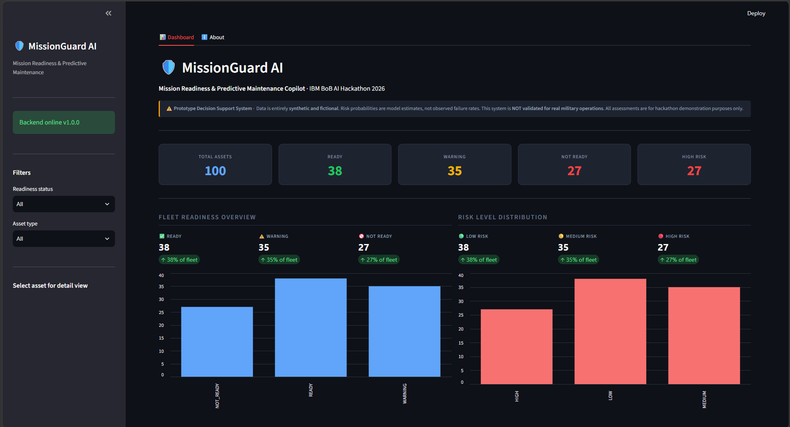
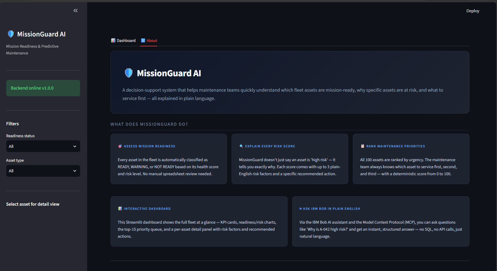
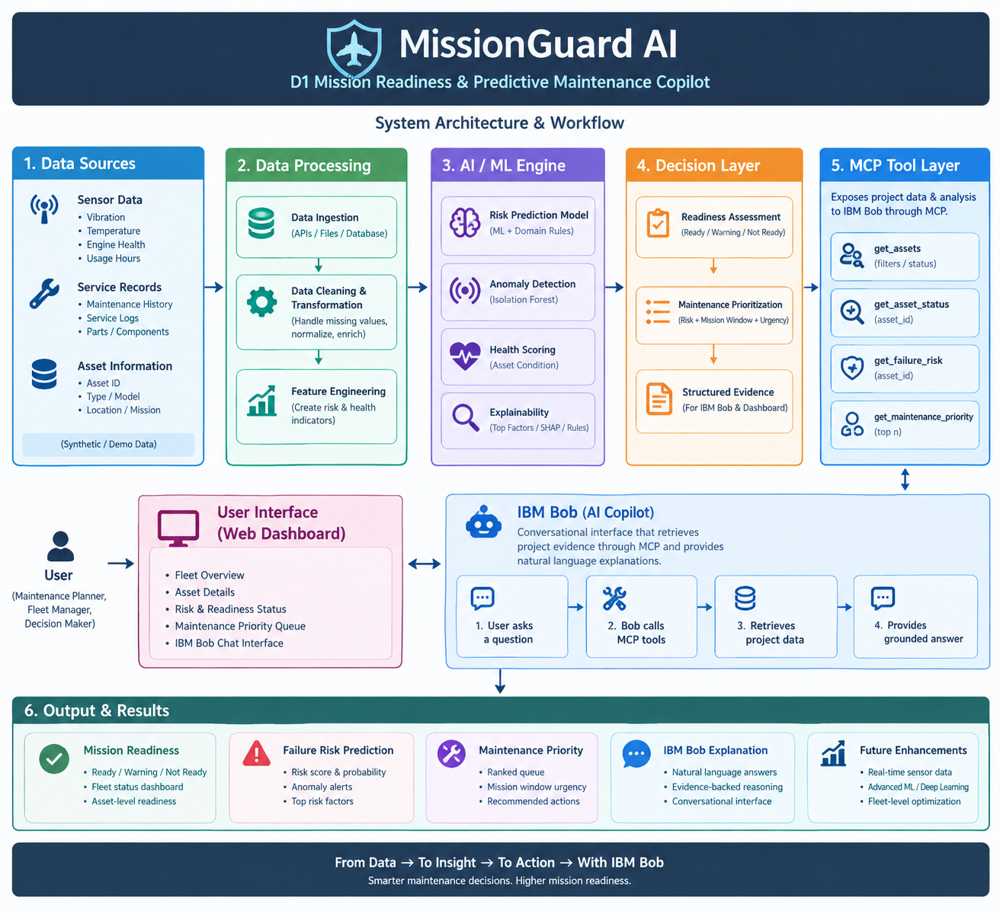

# MissionGuard AI — Mission Readiness & Predictive Maintenance Copilot

MissionGuard AI is a prototype decision-support system built for the **IBM Bob AI Innovation Hackathon 2026 — D1: Mission Readiness & Predictive Maintenance**.

It analyzes a synthetic fleet of assets and helps users answer three important questions:

- Which assets are mission-ready?
- Which assets have the highest failure risk?
- Which assets should be prioritized for maintenance?

> **Disclaimer:** All telemetry data used by this project is synthetic and fictional. Risk probabilities are model estimates, not observed failure rates. This prototype is for demonstration and decision-support purposes only and must not be used for real military operations.

---
## PPTX and Demo Video Links 

- Presentation pptx : https://drive.google.com/drive/folders/1k47kmVCYf-Ok2xbD65SVtHsEWrNxNK0I
- Demo Video : https://drive.google.com/file/d/1Yd2msGzGF2exqdGPfy2g7lWjSvw3m2kf/view?usp=drivesdk

---

## Team

| Field | Details |
|---|---|
| **Team Name** | Team Nova |
| **Track** | AI |
| **Team Lead** | Himay Thummar |
| **Contact** | 24AIML069@charusat.edu.in |

### Team Members

| Name | ID | Role |
|---|---|---|
| Kinari Thummar | 24AIML070 | Lead Developer & Project Integration |
| Hetvi Patoliya | 24AIML050 | AI/ML & Presentation Developer |
| Himay Thummar | 24AIML069 | IBM Bob & MCP Integration Developer |
| Prince Vaghasiya | 24AIML074 | Frontend Developer & UI Contributor |

---

## Problem Statement

Maintaining a large fleet requires quick and understandable information about asset health and maintenance urgency.

Traditional spreadsheets and raw telemetry can make it difficult to determine:

- which assets are ready for a mission,
- why an asset is considered risky,
- which assets need attention first, and
- what action should be taken.

MissionGuard AI transforms this information into simple, explainable decision-support outputs.

---

## Solution

MissionGuard AI combines:

- synthetic asset telemetry,
- machine-learning risk prediction,
- domain-based health heuristics,
- mission-readiness classification,
- maintenance prioritization,
- explainable risk factors,
- a FastAPI backend,
- a Streamlit dashboard, and
- IBM Bob integration through MCP.

The numerical analysis is performed by the MissionGuard risk engine, while IBM Bob provides a natural-language interface for interacting with the results through MCP tools.

---

## Key Features

| Feature | Description |
|---|---|
| **Health Score** | Provides an asset health score from 0–100 |
| **Failure Risk** | Estimates failure probability and assigns LOW, MEDIUM, or HIGH risk |
| **Mission Readiness** | Classifies assets as READY, WARNING, or NOT_READY |
| **Explainability** | Provides human-readable risk factors and recommended actions |
| **Maintenance Priority** | Calculates a priority score and fleet-wide ranking |
| **Fleet Dashboard** | Shows fleet KPIs, readiness, risk distribution, and maintenance priority queue |
| **REST API** | Provides FastAPI endpoints for asset analysis with Swagger docs |
| **MCP Integration** | Exposes MissionGuard capabilities to IBM Bob via 5 MCP tools |
| **Conversational Queries** | Allows natural-language fleet queries through IBM Bob |

---

## Dashboard

The MissionGuard AI dashboard provides a simple overview of fleet readiness, risk, and maintenance needs.

It includes:

- total asset count,
- READY / WARNING / NOT_READY counts,
- risk distribution,
- maintenance priority queue,
- asset-level risk information,
- recommended actions, and
- backend connection status.

### Main Dashboard



> **Screenshot:** Main MissionGaurd Dashboard Overview.

### About / Project Details



> **Screenshot:** The Aboout page of Frontend containing Project Information.

---

## How MissionGuard AI Works

```text
Synthetic Asset Data
        │
        ▼
Data Processing & Feature Engineering
        │
        ▼
Risk Engine
        │
        ├── Health Score
        ├── Failure Probability
        ├── Risk Level
        ├── Mission Readiness
        ├── Risk Factors
        └── Maintenance Priority
        │
        ├──────────────────┐
        ▼                  ▼
   FastAPI API         MCP Server
        │                  │
        ▼                  ▼
   Streamlit           IBM Bob
   Dashboard       Conversational AI
```

---

## Architecture

```text
data/assets.csv  (100 synthetic assets, seed=42)
        │
        ▼
ML / Risk Engine   src/data/ + src/models/ + src/services/
        │
        │  Python function calls
        ▼
FastAPI REST API   src/api/main.py  →  http://localhost:8000
        │
        │  HTTP requests
        ▼
Streamlit Dashboard   src/dashboard/app.py  →  http://localhost:8501

ML / Risk Engine
        │
        │  Direct Python function calls
        ▼
MCP Server   src/mcp/server.py
        │
        │  stdio transport
        ▼
IBM Bob   Conversational interface
```

Each layer calls the one below it without reimplementing its logic.



> **Screenshot:** Main MissionGaurd AI System Architechture and entire project workflow.
---

## Repository Structure

```
├── src/
│   ├── api/              # FastAPI REST API
│   │   └── main.py
│   ├── dashboard/        # Streamlit dashboard
│   │   ├── app.py
│   │   └── api_client.py
│   ├── mcp/              # MCP server for IBM Bob
│   │   └── server.py
│   ├── data/             # Data loading & generation
│   ├── models/           # ML risk model
│   ├── services/         # Risk engine, readiness, explainability
│   └── utils/            # Config, exceptions
├── tests/
│   ├── test_data_loader.py          #  5 tests — data layer
│   ├── test_risk_engine.py          #  9 tests — risk engine
│   ├── test_maintenance_priority.py #  8 tests — priority
│   ├── test_api.py                  # 11 tests — REST API
│   ├── test_dashboard.py            # 16 tests — dashboard
│   └── test_mcp.py                  # 22 tests — MCP tools
├── data/assets.csv        # Synthetic fleet dataset (100 assets)
├── docs/
│   ├── architecture.md
│   ├── mcp-integration.md
│   ├── risk-engine.md
│   └── setup-guide.md
├── run_mcp_server.py      # MCP server launcher (stdio transport)
├── requirements.txt
├── pytest.ini
└── submission.yaml
```

---

## Tech Stack

| Layer | Technology | Version |
|---|---|---|
| Language | Python | 3.14 (3.11+ supported) |
| ML / Data | pandas, NumPy, scikit-learn, joblib | 3.0.5, 2.5.3, 1.9.1, 1.6.0 |
| API | FastAPI, uvicorn | 0.141+, 0.53+ |
| Dashboard | Streamlit, requests | 1.63+, 2.34+ |
| Testing | pytest, pytest-asyncio, httpx | 9.1.1, 1.4.0, 0.28.1 |
| MCP | mcp[cli] | 2.2+ |
| Data store | Local CSV | — |

---

## Installation

### Prerequisites

- Python 3.11 or later (tested with Python 3.14 on Windows)
- pip

### Install dependencies

```powershell
pip install -r requirements.txt
```

> **Note:** `requirements.txt` pins minimum versions. pip will automatically select compatible wheels for your Python version.

### Environment variables (optional)

Copy `src/.env.example` to `.env`. No credentials are required for local development —
the system uses a local synthetic CSV file and does not connect to any external service by default.

```
# src/.env.example — optional overrides
MISSIONGUARD_RANDOM_SEED=42

# Reserved for IBM Bob / watsonx — not used locally
# WATSONX_API_KEY=your_api_key_here
# WATSONX_PROJECT_ID=your_project_id_here
# WATSONX_URL=https://us-south.ml.cloud.ibm.com
# MISSIONGUARD_API_URL=http://localhost:8000
```

---

## How to Run

### 1 — Generate the dataset (first time only)

```powershell
python -m src.data.generate_dataset
```

Creates `data/assets.csv` with 100 reproducible synthetic assets (seed=42). Safe to re-run.

### 2 — Start the FastAPI backend (Terminal 1)

```powershell
python -m uvicorn src.api.main:app --reload --port 8000
```

| URL | Description |
|---|---|
| http://localhost:8000/health | Health check |
| http://localhost:8000/assets | All 100 assets |
| http://localhost:8000/docs | Swagger UI |
| http://localhost:8000/redoc | ReDoc |

### 3 — Start the Streamlit dashboard (Terminal 2)

```powershell
python -m streamlit run src/dashboard/app.py
```

Dashboard available at **http://localhost:8501**

Override the backend URL if needed:

```powershell
$env:MISSIONGUARD_API_URL = "http://my-server:8000"
python -m streamlit run src/dashboard/app.py
```

### 4 — Run the MCP server for IBM Bob (Terminal 3)

```powershell
python run_mcp_server.py
```

The server runs over stdio and is ready for IBM Bob to connect.
See [docs/mcp-integration.md](docs/mcp-integration.md) for IBM Bob configuration details.

### 5 — Run the test suite

```powershell
python -m pytest -v
```

Expected result: **71 tests passing**.

```
tests/test_data_loader.py            5 passed
tests/test_risk_engine.py            9 passed
tests/test_maintenance_priority.py   8 passed
tests/test_api.py                   11 passed
tests/test_dashboard.py             16 passed
tests/test_mcp.py                   22 passed
──────────────────────────────────────────────
71 passed in 3.69s
```

Non-fatal warnings (safe to ignore):
- ~1901 sklearn `UserWarning` about feature names — informational, no effect on scores
- 1 Starlette/AnyIO `DeprecationWarning` — benign

### 6 — (Optional) Run the risk engine directly

```powershell
python -m src
```

Generates the dataset if missing, scores all assets, and prints a summary to the console.

---

## REST API Endpoints

| Method | Path | Status codes | Description |
|---|---|---|---|
| GET | `/health` | 200 | Service health check |
| GET | `/assets` | 200 | All 100 assets with risk and readiness |
| GET | `/assets/{id}/status` | 200, 404 | Readiness status for one asset |
| GET | `/assets/{id}/risk` | 200, 404 | Failure risk analysis for one asset |
| GET | `/assets/{id}/priority` | 200, 404 | Maintenance priority for one asset |

All 404 responses return `{"detail": "Asset {id} not found"}`.

### Example requests

```bash
curl http://localhost:8000/health
curl http://localhost:8000/assets
curl http://localhost:8000/assets/A-001/status
curl http://localhost:8000/assets/A-042/risk
curl http://localhost:8000/assets/A-017/priority
```

### Example response — `/assets/A-001/risk`

```json
{
  "asset_id": "A-001",
  "health_score": 25.1,
  "failure_probability": 0.7488,
  "risk_level": "HIGH",
  "top_risk_factors": [
    "High utilization intensity",
    "High operating hours",
    "Elevated fuel consumption"
  ],
  "recommended_action": "Schedule inspection and preventive maintenance"
}
```

---

## MCP Tools (IBM Bob Integration)

The MCP server exposes 5 tools. It connects directly to the risk engine and does not duplicate any scoring logic.

| Tool | Parameters | Description |
|---|---|---|
| `list_assets` | `readiness_filter`, `risk_filter`, `asset_type_filter` (all optional) | List fleet assets with optional filtering |
| `get_asset_readiness` | `asset_id` (required) | Mission-readiness status and evidence |
| `get_asset_failure_risk` | `asset_id` (required) | Failure probability, risk level, risk factors |
| `get_asset_maintenance` | `asset_id` (required) | Priority score, fleet rank, priority reasons |
| `get_fleet_summary` | none | Fleet-wide counts, percentages, top 10 priority assets |

### Example conversational queries

```
"Which assets are not mission-ready?"
→ list_assets(readiness_filter="NOT_READY")  → 27 assets

"Show all high-risk UAVs"
→ list_assets(risk_filter="HIGH", asset_type_filter="UAV")

"Is asset A-017 mission-ready?"
→ get_asset_readiness("A-017")

"Why is asset A-042 at risk?"
→ get_asset_failure_risk("A-042")
→ HIGH risk, failure_probability=0.623
→ factors: High utilization intensity, Many days since last service, Elevated fuel consumption

"Which asset should we service first?"
→ get_fleet_summary() → top priority: A-017 (score=100, rank=1)

"Give me a fleet health overview"
→ get_fleet_summary()
→ 100 assets: 38 READY (38%), 35 WARNING (35%), 27 NOT_READY (27%)
→ 38 LOW risk, 35 MEDIUM risk, 27 HIGH risk
```

### IBM Bob configuration

The workspace-scoped config is already committed at `.bob/mcp.json`. For reference:

```json
{
  "mcpServers": {
    "missionguard-mcp": {
      "command": "python",
      "args": ["run_mcp_server.py"],
      "cwd": "${workspaceFolder}",
      "alwaysAllow": [],
      "disabled": false
    }
  }
}
```

See [docs/mcp-integration.md](docs/mcp-integration.md) for full IBM Bob setup, HTTP transport, and watsonx configuration.

---

## Fleet Statistics (verified from live system)

| Metric | Value |
|---|---|
| Total assets | 100 |
| READY | 38 (38%) |
| WARNING | 35 (35%) |
| NOT_READY | 27 (27%) |
| LOW risk | 38 |
| MEDIUM risk | 35 |
| HIGH risk | 27 |
| Highest priority asset | A-017 (score 100, rank 1) |

---

## Known Limitations

- **Synthetic data only** — no real platform telemetry
- **Logistic regression + heuristic blend** — not deep learning
- **Labels are generated**, not observed failure rates
- **~1901 sklearn feature-name warnings** — informational, not errors; safe to ignore
- **Dashboard requires the FastAPI backend** to be running separately
- **IBM Bob live connection** requires a separate IBM Bob installation and configuration
- **No authentication** — suitable for demo, not production deployment
- **No persistence** — model is re-fit from the CSV on each cold start (fast: < 1 second)
- **Local demo only** — no public deployment

---

## IBM Bob Integration — What Is and Isn't Implemented

### Implemented locally (verified)

- MCP server (`src/mcp/server.py`) with all 5 tools
- stdio transport via `run_mcp_server.py`
- Full test suite for all MCP tool logic (22 tests passing)
- IBM Bob workspace config at `.bob/mcp.json`
- IBM Bob MCP integration demonstrated locally

### Requires IBM Bob configuration

- Installing IBM Bob on your machine
- Opening this folder as a workspace in IBM Bob
- Testing the natural-language conversation flow end-to-end

### Requires credentials or deployment setup

- `WATSONX_API_KEY`, `WATSONX_PROJECT_ID`, `WATSONX_URL` for watsonx.ai integration
- A deployed server for remote/HTTP MCP transport
- No fake credentials are in this repository; environment variables are documented in `src/.env.example`

---

## Security & Data Disclaimer

- No real credentials, API keys, or secrets are committed to this repository
- `src/.env.example` documents variable names only — never actual values
- `.env` is listed in `.gitignore`
- All asset data is entirely synthetic and randomly generated
- This system is not validated for any operational or safety-critical use

---

## What We're Most Proud Of

- **Clean layering:** each component builds strictly on the previous one, no logic duplication
- **Explainability by design:** every risk score is backed by human-readable factor phrases
- **71 automated tests** covering data, ML, API, dashboard client, and MCP layers
- **IBM Bob–ready MCP integration** with clear separation between what works locally and what needs Bob configuration
- **Graceful degradation:** dashboard shows a clear message when the API is offline rather than crashing

---

## Documentation

| Document | Contents |
|---|---|
| [docs/architecture.md](docs/architecture.md) | System design and data flow |
| [docs/mcp-integration.md](docs/mcp-integration.md) | IBM Bob setup, MCP tools, watsonx config |
| [docs/risk-engine.md](docs/risk-engine.md) | Risk scoring algorithm and thresholds |
| [docs/setup-guide.md](docs/setup-guide.md) | Detailed installation and troubleshooting |
| [QUICKSTART.md](QUICKSTART.md) | Fast-start commands |
