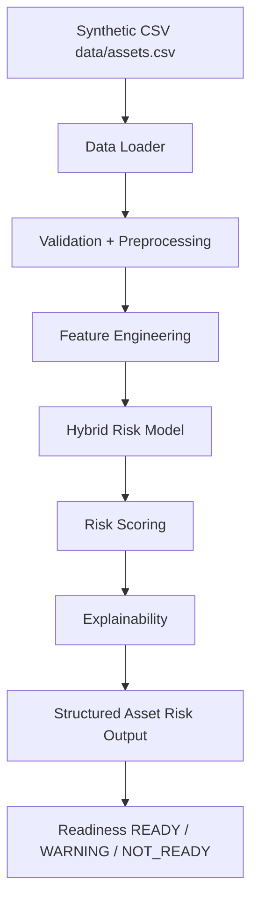

# Architecture

## Current phase (Agent 1)

This repository currently implements the **offline risk core** only: synthetic CSV → validation → features → hybrid model → scored asset records. IBM Bob, MCP, HTTP APIs, and UI are explicitly out of scope until later agents.

## Components

| Component | Technology | Responsibility |
|---|---|---|
| Synthetic generator | Python / NumPy / pandas | Reproducible fictional fleet (`seed=42`) |
| Data loader | pandas | Read CSV, schema checks, optional regenerate |
| Preprocessing | pandas | Coerce types, impute missing values |
| Feature engineering | pandas | Maintenance-gap and stress features |
| Risk model | scikit-learn LogisticRegression | Interpretable failure probability |
| Domain blend | NumPy | Median/IQR heuristic mixed with ML |
| Readiness | Python | Configurable READY / WARNING / NOT_READY |
| Explainability | Model coefficients | Top risk-factor phrases |
| API contract | Python functions | `get_all_assets`, `get_asset_status`, `get_failure_risk` |

## Data Flow

1. `src/data/generate_dataset.py` writes `data/assets.csv` (or the file is reused).
2. `load_assets` validates required columns.
3. `preprocess_assets` imputes gaps and parses service dates.
4. `engineer_features` builds the model matrix.
5. Logistic regression is fit on the synthetic `failure_label`; probabilities are blended with a domain score.
6. Health, risk level, readiness, factors, and recommended action are attached to each `asset_id`.
7. Later agents should call the Python functions in `src/services/risk_engine.py` rather than re-implementing scoring.

## Security Considerations

- No real military or operational telemetry is used or requested.
- No cloud credentials are required for this phase.
- `.venv/` and `*.joblib` snapshots are gitignored; `.env` remains gitignored.

## Scalability Notes

The current engine scores ~100 rows in-process on each load. A later FastAPI/MCP layer can wrap the same `RiskEngine` class without changing the scoring math. Horizontal scale is not required for the hackathon prototype.
